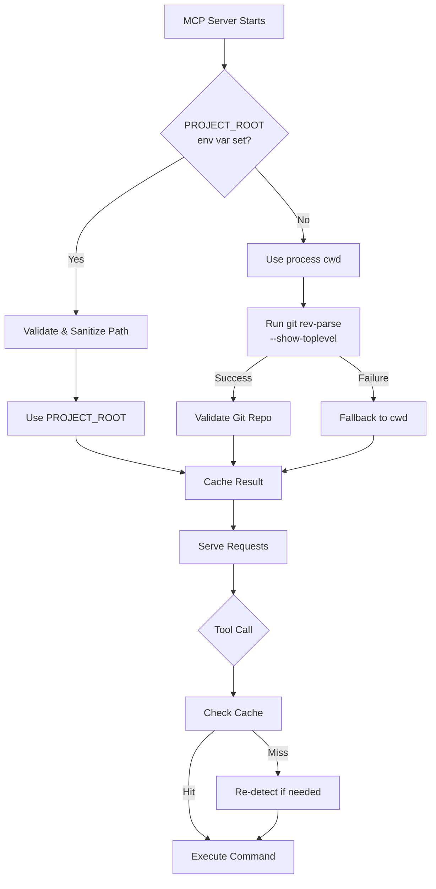

# Robust Git Workspace Detection - Comprehensive Fix

## Problem Summary

The current implementation has fundamental flaws:

- Uses `os.getcwd()` which is evaluated once at startup
- Manual `.git` detection misses edge cases (worktrees, submodules, bare repos)
- No error handling, security validation, or caching
- Race conditions and performance issues
- Untestable code

## Architecture Decision

**Accept MCP Protocol Limitation**: MCP servers are long-running processes that don't receive workspace context per request. Each server instance operates on ONE workspace, determined at startup via the `cwd` config parameter.

**Solution**: Make workspace detection extremely robust, secure, and handle all edge cases properly.



## Implementation Plan

### 1. Create Workspace Context Manager

**File**: [`mcp_server/workspace.py`](mcp_server/workspace.py) (NEW)

Create a dedicated module for workspace detection with:

- Thread-safe workspace detection with locking
- LRU cache for git root detection (TTL: 60s)
- Comprehensive error handling with typed exceptions
- Security: Path validation and sanitisation
- Support for git worktrees, submodules, bare repos

**Key Classes**:

```python
class WorkspaceError(Exception): pass
class GitNotFoundError(WorkspaceError): pass
class InvalidWorkspaceError(WorkspaceError): pass

class WorkspaceDetector:
    def __init__(self):
        self._lock = threading.RLock()
        self._cache = {}  # path -> (result, timestamp)
        self._cache_ttl = 60
    
    def detect_workspace(self, override: str = None) -> Path:
        """Detect workspace with comprehensive error handling"""
    
    def _use_git_command(self, cwd: Path) -> Optional[Path]:
        """Use git rev-parse --show-toplevel (handles worktrees, submodules)"""
    
    def _validate_git_repo(self, path: Path) -> bool:
        """Validate it's actually a git repo (run git status)"""
    
    def _sanitize_path(self, path: str) -> Path:
        """Security: Resolve symlinks, check permissions, validate"""
```

### 2. Fix Git Command Execution

**File**: [`mcp_server/server.py`](mcp_server/server.py)

Replace `run_git_command` with secure, properly-escaped version:

**Issues to fix**:

- Remove shell=True on Windows (security risk)
- Use `shlex.quote()` for proper escaping
- Add proper timeout handling
- Add retry logic for transient failures
- Log commands for debugging (without exposing sensitive data)

**Changes**:

```python
async def run_git_command(
    cmd: list[str], 
    cwd: Path = None,
    timeout: float = 15.0,
    retry: int = 1
) -> GitCommandResult:
    """
    Execute git command with proper error handling.
    
    Args:
        cmd: Git command as list
        cwd: Working directory (auto-detected if None)
        timeout: Command timeout
        retry: Number of retries for transient failures
        
    Returns:
        GitCommandResult with stdout, stderr, returncode, duration
        
    Raises:
        GitCommandTimeout: Command timed out
        GitCommandError: Command failed
        WorkspaceError: Invalid workspace
    """
```

### 3. Handle Git Edge Cases

**File**: [`mcp_server/git_utils.py`](mcp_server/git_utils.py) (NEW)

Create utilities to handle:

**Git Worktrees**:

- Check if `.git` is a file (worktree) vs directory (main repo)
- Parse `.git` file to find actual git dir
- Use `git rev-parse --git-common-dir` for worktree detection

**Git Submodules**:

- Check for `.gitmodules` file
- Use `git rev-parse --show-superproject-working-tree` 
- Let user choose: work in submodule or parent repo

**Bare Repositories**:

- Detect via `git rev-parse --is-bare-repository`
- Handle differently (no working tree)

**Nested Repositories**:

- Detect via `git rev-parse --show-superproject-working-tree`
- Prefer closest `.git` to cwd

### 4. Add Comprehensive Error Handling

**Security Validation** (in `workspace.py`):

```python
def _sanitize_path(self, path: str) -> Path:
    # Resolve symlinks
    resolved = Path(path).resolve(strict=False)
    
    # Check for path traversal
    if '..' in resolved.parts:
        raise InvalidWorkspaceError("Path traversal detected")
    
    # Validate exists and is directory
    if not resolved.exists():
        raise InvalidWorkspaceError(f"Path does not exist: {resolved}")
    if not resolved.is_dir():
        raise InvalidWorkspaceError(f"Not a directory: {resolved}")
    
    # Check permissions
    if not os.access(resolved, os.R_OK | os.X_OK):
        raise InvalidWorkspaceError(f"Insufficient permissions: {resolved}")
    
    return resolved
```

**Error Recovery**:

- Graceful degradation when git not available
- Clear error messages for users
- Fallback strategies with logging
- Don't fail silently

### 5. Performance Optimisations

**Caching Strategy**:

```python
# Cache workspace detection result (invalidate after 60s or on error)
# Cache git command results for idempotent operations (status, diff)
# Use LRU cache with size limits

@dataclass
class CacheEntry:
    value: Any
    timestamp: float
    hits: int
    
class WorkspaceCache:
    def get(self, key: str, ttl: float = 60) -> Optional[Any]:
        """Get from cache with TTL"""
    
    def set(self, key: str, value: Any):
        """Set cache entry with timestamp"""
    
    def invalidate(self, pattern: str = None):
        """Invalidate cache entries"""
```

**Optimisations**:

- Call `git rev-parse` once at startup, cache result
- Only re-detect on explicit errors (repo moved/deleted)
- Batch git operations where possible
- Use `--no-optional-locks` flag to avoid lock contention

### 6. Windows-Specific Fixes

**File**: [`mcp_server/platform_utils.py`](mcp_server/platform_utils.py) (NEW)

**Issues to fix**:

- Remove shell=True (command injection risk)
- Use subprocess directly with list args
- Handle UNC paths (`\\server\share`)
- Handle long paths (>260 chars) with `\\?\` prefix
- Use `CREATE_NO_WINDOW` properly
```python
def get_subprocess_kwargs(is_background: bool = False) -> dict:
    """Get platform-specific subprocess kwargs"""
    kwargs = {
        'stdout': subprocess.PIPE,
        'stderr': subprocess.PIPE,
        'stdin': subprocess.DEVNULL,
        'text': True,
        'shell': False,  # NEVER use shell=True
    }
    
    if sys.platform == 'win32':
        # CREATE_NO_WINDOW = 0x08000000
        flags = subprocess.CREATE_NO_WINDOW
        if is_background:
            flags |= subprocess.CREATE_NEW_PROCESS_GROUP
        kwargs['creationflags'] = flags
    
    return kwargs
```


### 7. Make Code Testable

**File**: [`tests/test_workspace.py`](tests/test_workspace.py) (NEW)

Add comprehensive tests:

```python
class TestWorkspaceDetector:
    def test_detect_from_env_var(self, monkeypatch, tmp_path)
    def test_detect_from_git_command(self, git_repo)
    def test_detect_worktree(self, git_worktree)
    def test_detect_submodule(self, git_submodule)
    def test_detect_bare_repo(self, bare_repo)
    def test_security_path_traversal(self)
    def test_invalid_permissions(self, tmp_path)
    def test_cache_expiry(self)
    def test_concurrent_access(self)
    def test_network_drive_timeout(self, mock_slow_fs)
```

**File**: [`tests/test_git_utils.py`](tests/test_git_utils.py) (NEW)

**File**: [`tests/conftest.py`](tests/conftest.py) (NEW) - fixtures for git repos

### 8. Update Server Integration

**File**: [`mcp_server/server.py`](mcp_server/server.py)

**Changes**:

- Replace manual `_find_git_root` with `WorkspaceDetector`
- Remove dead code (`_initial_repo_dir`)
- Update `run_git_command` to use new utilities
- Add proper logging
- Update debug tool to show comprehensive diagnostics
```python
# At module level
_workspace_detector = WorkspaceDetector()
_workspace_cache = WorkspaceCache()

async def run_git_command(cmd: list[str], cwd: Path = None) -> GitCommandResult:
    if cwd is None:
        cwd = _workspace_detector.detect_workspace()
    # ... rest of implementation
```


### 9. Documentation Updates

**File**: [`mcp_server/README.md`](mcp_server/README.md) (NEW)

Document:

- Architecture decisions (why single-workspace-per-instance)
- Supported git configurations (worktrees, submodules, etc.)
- Error handling and troubleshooting
- Performance characteristics
- Testing approach

**File**: [`MCP_SETUP.md`](MCP_SETUP.md)

Update to reflect:

- One MCP server instance = one workspace
- How to set up multiple projects (multiple server configs)
- How PROJECT_ROOT override works
- Troubleshooting guide

### 10. Add Logging and Observability

**File**: [`mcp_server/logging_config.py`](mcp_server/logging_config.py) (NEW)

Add structured logging:

```python
import logging
import sys

def setup_logging(level: str = "INFO"):
    """Configure logging for MCP server"""
    logging.basicConfig(
        level=level,
        format='%(asctime)s [%(levelname)s] %(name)s: %(message)s',
        handlers=[logging.StreamHandler(sys.stderr)]  # stderr to not interfere with stdio protocol
    )
```

Log key events:

- Workspace detection result
- Git command execution (with timing)
- Cache hits/misses
- Errors and fallbacks

## Files to Create

- `mcp_server/workspace.py` - Workspace detection
- `mcp_server/git_utils.py` - Git-specific utilities
- `mcp_server/platform_utils.py` - Platform-specific helpers
- `mcp_server/logging_config.py` - Logging setup
- `tests/test_workspace.py` - Workspace tests
- `tests/test_git_utils.py` - Git utils tests
- `tests/conftest.py` - Test fixtures

## Files to Modify

- `mcp_server/server.py` - Use new workspace detection, remove dead code
- `MCP_SETUP.md` - Update documentation
- `pyproject.toml` - Add test dependencies (pytest, pytest-asyncio, pytest-mock)

## Testing Strategy

1. Unit tests for workspace detection (90%+ coverage)
2. Integration tests with real git repos
3. Edge case tests (worktrees, submodules, permissions)
4. Performance tests (caching effectiveness)
5. Security tests (path traversal, injection)

## Migration Path

1. Implement new modules without breaking existing code
2. Add tests for new functionality
3. Gradually migrate server.py to use new modules
4. Deprecate old functions
5. Update documentation

## Success Criteria

- All edge cases from code review addressed
- 90%+ test coverage
- No security vulnerabilities (path traversal, command injection)
- Performance: <10ms for cached workspace detection
- Clear error messages for all failure modes
- Works with worktrees, submodules, bare repos